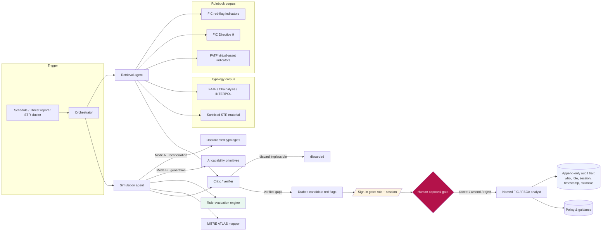
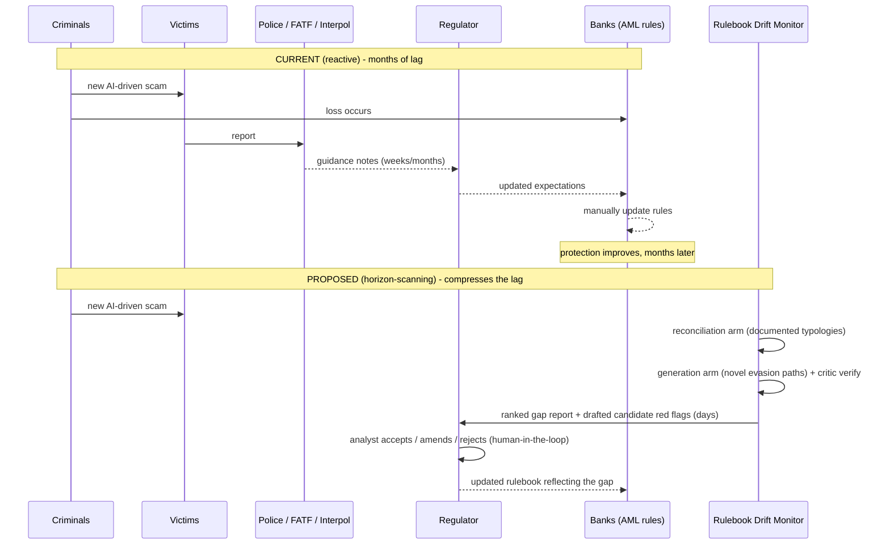
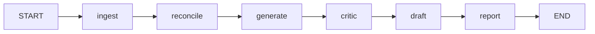
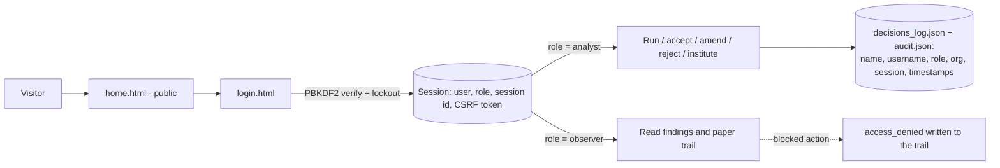

# Rulebook Drift Monitor — Architecture

## Component / agent view

## Detection-gap workflow (current vs proposed)

## LangGraph orchestration graph

## Access control

The findings surface is an attack map, so it sits behind a sign-in. Only the landing page and the
sign-in page are public; every other page redirects and every API route returns 401 without a
session.

